# MumbaiHack-25

## PFA DESC of Project
# Invoice Processing System - AI Powered

## Overview
The Invoice Processing System is a sophisticated AI-powered application that automates the extraction of structured data from invoices using multiple OCR engines and Large Language Models (LLMs). This system transforms unstructured PDF invoices into structured JSON data and provides an intuitive interface for querying extracted information using natural language.

## Snapshots


## Flow of Diagram

```mermaid
%%{init: {'theme': '', 'themeVariables': { 'primaryColor': '#1a1a1a', 'textColor': '#ffffff'}}}%%
flowchart TD
    A[User Uploads PDF Invoice] --> B{File Validation}
    B -->|Valid PDF| C[Store Temporarily]
    B -->|Invalid| D[Show Error Message]
    
    C --> E[Generate PDF Preview]
    E --> F[Select OCR Engine]
    
    F --> G[Extract Text with OCR]
    G --> H{Text Quality Check}
    H -->|Low Quality| I[Try Fallback OCR]
    H -->|Good Quality| J[Normalize Text]
    
    I --> H
    J --> K[Select LLM Model]
    
    K --> L[Construct LLM Prompt]
    L --> M[Call LLM API]
    M --> N[Validate JSON Response]
    N --> O[Store Structured Data]
    
    O --> P[Display Results UI]
    P --> Q{User Query?}
    
    Q -->|Yes| R[Process Natural Language Query]
    Q -->|No| S[Wait for Interaction]
    
    R --> T[Select Query LLM]
    T --> U[Construct Query Context]
    U --> V[Call LLM API]
    V --> W[Format Response]
    W --> X[Display Answer]
    
    %% System Monitoring
    subgraph Monitoring
        Y[Performance Metrics]
        Z[Health Checks]
        AA[Error Logging]
    end
    
    G -->|Log| AA
    M -->|Log| AA
    V -->|Log| AA
    C -->|Metrics| Y
    M -->|Metrics| Y
    V -->|Metrics| Y
    Z -.->|API Status| M
    Z -.->|API Status| V
    
    %% Style Definitions
    classDef userAction fill:#2563eb,stroke:#fff
    classDef processing fill:#7c3aed,stroke:#fff
    classDef decision fill:#059669,stroke:#fff
    classDef error fill:#dc2626,stroke:#fff
    classDef storage fill:#ea580c,stroke:#fff
    classDef display fill:#f59e0b,stroke:#fff
    classDef monitoring fill:#333333,stroke:#fff
    
    class A,D userAction
    class B,F,G,I,J,K,L,M,N,T,U,V,W decision
    class C,E,O,P,Q,R,S,X processing
    class H error
    class Y,Z,AA monitoring
    class X display
```


## Key Features

### Multi-Engine OCR Processing
- **Auto Selection**: Intelligently chooses the best OCR engine based on content
- **Supported OCR Engines**:
  - PyMuPDF (fast text extraction)
  - PDFPlumber (structured extraction)
  - PDFMiner (text-focused extraction)
  - Tesseract OCR (image-based extraction)
  - Enhanced Tesseract (high-quality extraction)

### AI-Powered Data Extraction
- **Multiple LLM Support**:
  - Mistral Large (Latest)
  - Llama 3.1 (70B)
  - Llama 3.2 (90B)
  - Llama 3.3 (70B)
  - Llama Vision (11B)
  - Grok 3 (314B)
  - Grok 4 (405B)
  - Cohere Command R+

### Intelligent Query System
- Natural language processing for invoice queries
- Confidence-based responses
- Field-level extraction from questions
- Example queries for quick access

### Performance Monitoring
- Real-time system metrics
- Processing time tracking
- Error rate monitoring
- Resource utilization statistics

### Security Features
- Secure file handling
- Security headers (XSS protection, frame prevention)
- File size restrictions (16MB max)
- Environment variable configuration

## User Interface Overview

### Upload Section
- Drag-and-drop PDF upload area
- Model selection for OCR and LLM processing
- File information display
- Processing status indicators

### Results Section
1. **Document Preview**
   - First-page preview with zoom capability
   - Base64-encoded image display

2. **Extracted Data**
   - Syntax-highlighted JSON output
   - Copy-to-clipboard functionality
   - Processing method badges (OCR/LLM)

3. **AI Responses**
   - Natural language answers to queries
   - Confidence indicators (high/medium/low)
   - Extracted fields display
   - Response source model identification

### Query Section
- Natural language question input
- LLM selection for query processing
- Example questions for quick access
- Processing status indicators

## Workflow

1. **Upload & Process**:
   - User uploads PDF invoice
   - System selects OCR engine (user-selected or auto)
   - Extracted text is sent to selected LLM
   - Structured JSON data is generated

2. **Results Display**:
   - Document preview shown
   - Structured data displayed in JSON format
   - Processing metrics shown

3. **Natural Language Querying**:
   - User asks questions about the invoice
   - System processes query with selected LLM
   - Response displayed with confidence indicators
   - Relevant fields extracted and shown

## System Requirements

### Backend Requirements
- Python 3.9+
- Flask
- PyMuPDF (fitz)
- pytesseract
- pdfminer.six
- pdfplumber
- Pillow (PIL)
- python-dotenv
- requests
- psutil

### OCR Requirements
- Tesseract OCR installed (`/usr/bin/tesseract` by default)
- Proper Tesseract language packs

### Frontend Requirements
- Modern browser (Chrome, Firefox, Edge)
- JavaScript enabled

### Optional Requirements
- OCI credentials for OCI LLM models
- Mistral API key for Mistral models

## Installation

```bash
# Clone the repository
git clone https://github.com/yourusername/invoice-processing-system.git
cd invoice-processing-system

# Create virtual environment
python -m venv venv
source venv/bin/activate

# Install dependencies
pip install -r requirements.txt

# Install Tesseract OCR (Ubuntu example)
sudo apt install tesseract-ocr
sudo apt install libtesseract-dev

# Create environment file
echo "SECRET_KEY=your_secret_key_here" > .env
echo "MISTRAL_API_KEY=your_mistral_api_key" >> .env

# Create upload directory
mkdir uploads

# Run the application
python app.py
```

## Configuration

Configure the system using the `.env` file:

```ini
# Required
SECRET_KEY=your_flask_secret_key
UPLOAD_FOLDER=uploads

# Optional
MAX_CONTENT_LENGTH=16777216  # 16MB
TESSERACT_CMD=/usr/bin/tesseract

# Mistral API
MISTRAL_API_KEY=your_api_key

# OCI Configuration
OCI_COMPARTMENT_ID=your_compartment_id
OCI_COHERE_MODEL=your_cohere_model_id
OCI_LLAMA_31_MODEL=your_llama_31_model_id
OCI_LLAMA_32_MODEL=your_llama_32_model_id
OCI_LLAMA_33_MODEL=your_llama_33_model_id
OCI_LLAMA_VISION_MODEL=your_vision_model_id
OCI_GROK_3_MODEL=your_grok_3_model_id
OCI_GROK_4_MODEL=your_grok_4_model_id
```

## Usage Instructions

1. **Upload a PDF Invoice**:
   - Drag and drop a PDF file or click to select
   - Choose OCR and AI processing models
   - Click "Process Document"

2. **Review Results**:
   - View document preview
   - Examine structured JSON data
   - Note processing method badges

3. **Ask Questions**:
   - Type natural language questions about the invoice
   - Select query processing model
   - Click "Ask Question" or press Ctrl+Enter
   - Review AI response with confidence indicators

4. **Use Example Queries**:
   - Click on example questions to populate the query field
   - Common examples include:
     - "What is the invoice number?"
     - "Who is the vendor?"
     - "What is the total amount?"

## API Endpoints

- `POST /upload`: Process uploaded PDF invoice
- `POST /query`: Process natural language queries
- `GET /health`: System health check
- `GET /metrics`: Performance metrics

## Troubleshooting

### Common Issues
1. **OCR Extraction Failure**:
   - Ensure Tesseract is properly installed
   - Verify Tesseract path in `.env` file
   - Check PDF is not image-only (may require better OCR engine)

2. **LLM Processing Errors**:
   - Verify API keys for Mistral/OCI
   - Check model availability in OCI
   - Ensure sufficient permissions for OCI resources

3. **File Upload Issues**:
   - Verify file is PDF format
   - Check file size (<16MB)
   - Ensure uploads directory exists and has write permissions

### Logs
- Application logs: `logs/invoice_processor.log`
- Error logs: `logs/errors.log`

## License
This project is licensed under the MIT License. See the [LICENSE](LICENSE) file for details.
